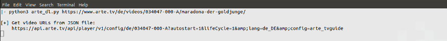
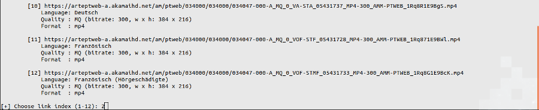
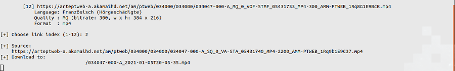
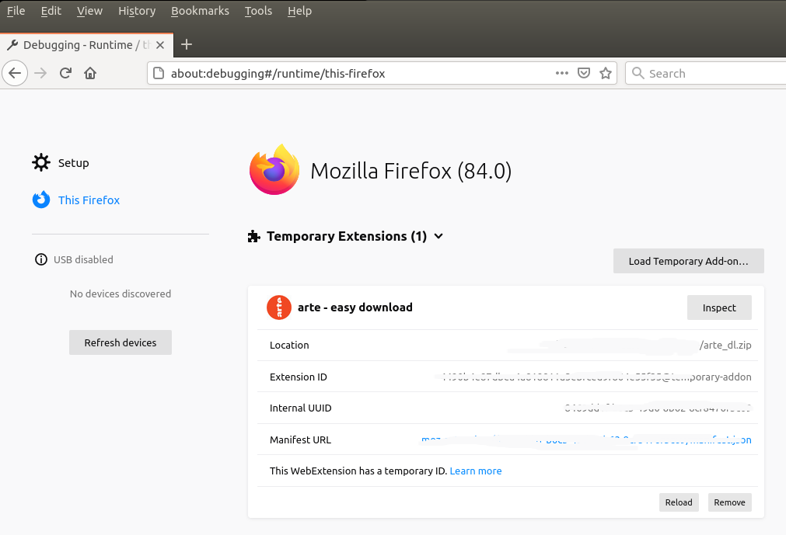
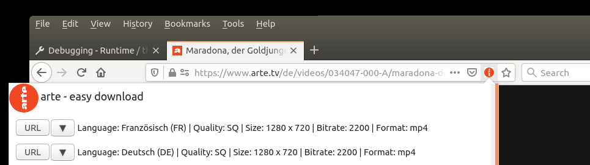
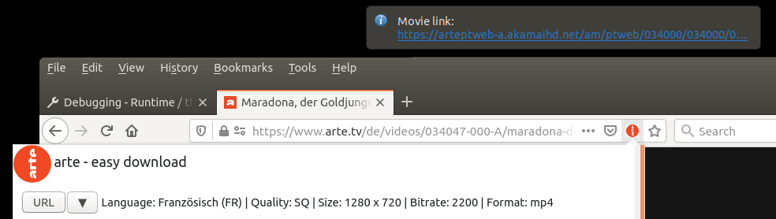

## arte - easy download
If you can't access [arte TV](https://www.arte.tv/) at your current location, this repo may help.  
It contains two *independent* tools:  
- a Python-3 command line script
- a Firefox extension

The simple idea behind both is that the URL you are browsing, for instance

<pre>
https://www.arte.tv/de/videos/<b>034047-000-A</b>/maradona-der-goldjunge/
</pre>

may not be accessible, but it contains the substring **034047-000-A** (VID), which is enough to derive the URL of the JSON file

<pre>
https://api.arte.tv/api/player/v1/config/de/<b>034047-000-A</b>?autostart=1&lifeCycle=1&amp;lang=de_DE&amp;config=arte_tvguide
</pre>

that contains the URLs of all the media (.mp4) files.


### Python
Use the Python script from the command line:

```shell
python3 arte_dl.py https://www.arte.tv/de/videos/034047-000-A/maradona-der-goldjunge/
```

<details><summary>Command line-1</summary>
<p align="center">

</p>
</details>

and it will output the URL of the JSON file

<details><summary>Command line-2</summary>
<p align="center">

</p>
</details>

followed by a numbered list of mp4 resources, with some additional info (language, video size, bitrate).  
Tell the terminal which index you want to download

<details><summary>Command line-3</summary>
<p align="center">

</p>
</details>

and the file will be downloaded in the same folder, using an automatic file name made from the VID substring and the current date and time:

<details><summary>Command line-4</summary>
<p align="center">

</p>
</details>


### Firefox extension

#### Steps
1. Install the arte_dl.zip extension in Firefox (or make your own zip file, compressing the following files from the mozilla folder: manifest.json, popup.js, background.js, index.html, and the icons subfolder).  
To give it a try, the extension can be installed temporarily, selecting the zip file, or the manifest.json file when using the uncompressed files:

<details><summary>Firefox-1</summary>
<p align="center">

</p>
</details>

2. The pageAction becomes active only when visiting the URL pattern: "*://*.arte.tv/*"  
The extension can be run if the symbol 
<p align="center">  </p>
appears next to the URL bar.  
Click the symbol and a popup will list the available mp4 files.  

<details><summary>Firefox-2</summary>
<p align="center">

</p>
</details>

Each file has 2 options:
  - URL: get a notification with the mp4 URL (see image below). You can open the movie in another tab, watch it, download it manually, or use the URL otherwise.
  - Download (arrow): directly download the mp4 file to your default Downloads folder, using an automated file name (VID substring and current date and time) 

<details><summary>Firefox-3</summary>
<p align="center">

</p>
</details>


### Other solutions
Others have provided alternative solutions for the same problem, such as this wonderful [github repo](https://github.com/GuGuss/ARTE-7-Downloader).
