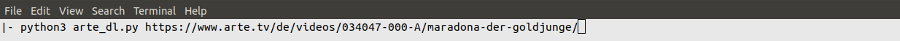

## arte - easy download
If you can't access [arte TV](https://www.arte.tv/) at your current location, this repo may help.  
It contains two independent tools:  
- a Python-3 command line script
- a Firefox extension

The simple idea is:
https://www.arte.tv/de/videos/**034047-000-A**/maradona-der-goldjunge/
and  
https://api.arte.tv/api/player/v1/config/de/**034047-000-A**?autostart=1&lifeCycle=1&amp;lang=de_DE&amp;config=arte_tvguide

<pre>
sample <b>sample</b> sample
</pre>

```
https://www.arte.tv/de/videos/**034047-000-A**/maradona-der-goldjunge/
```
and  
```
https://api.arte.tv/api/player/v1/config/de/**034047-000-A**?autostart=1&lifeCycle=1&amp;lang=de_DE&amp;config=arte_tvguide
```

```html
<span style="color:black;">https://www.arte.tv/de/videos/</span><span style="color:orange;">034047-000-A</span><span style="color:black;">/maradona-der-goldjunge/</span>
```
and
```html
<span style="color:black;">https://api.arte.tv/api/player/v1/config/de/</span><span style="color:orange;">034047-000-A</span><span style="color:black;">?autostart=1&lifeCycle=1&amp;lang=de_DE&amp;config=arte_tvguide</span>
```


### Python
Using the Python script:

```shell
python3 arte_dl.py https://www.arte.tv/de/videos/034047-000-A/maradona-der-goldjunge/
```

<details><summary>Command line-1</summary>
<p align="center">

</p>
</details>

<details><summary>Command line-2</summary>
<p align="center">

</p>
</details>

<details><summary>Command line-3</summary>
<p align="center">

</p>
</details>

<details><summary>Command line-4</summary>
<p align="center">

</p>
</details>

### Firefox extension
- Install the arte_dl.zip extension in Firefox
- The pageAction becomes active When visiting any site: "*://*.arte.tv/*"
- Click the arte symbol in the address line and a popup will list the available mp4 file list
- Each file has 2 options
  - URL: get a notification with the mp4 URL
  - Download: directly download the mp4 file

Steps:

<details><summary>Firefox-1</summary>
<p align="center">

</p>
</details>

<details><summary>Firefox-2</summary>
<p align="center">

</p>
</details>

<details><summary>Firefox-3</summary>
<p align="center">

</p>
</details>

<!--

-->

### Other solutions
Others have provided alternative solutions for the same problem, such as this wonderful [github repo](https://github.com/GuGuss/ARTE-7-Downloader).
